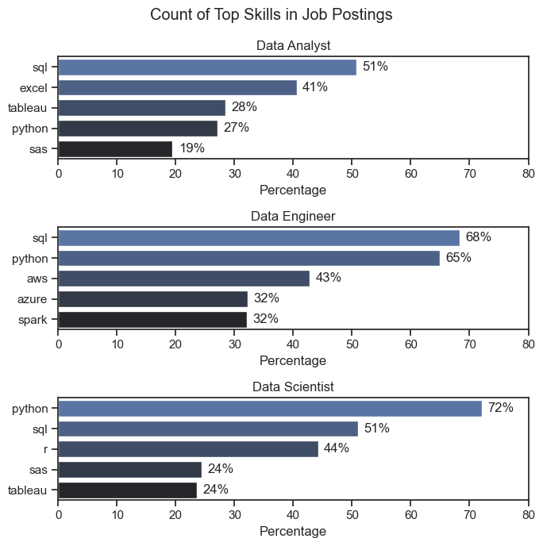
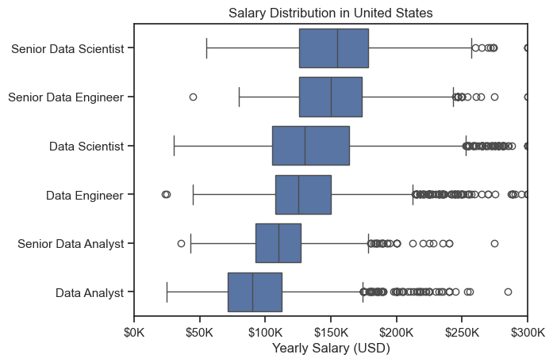
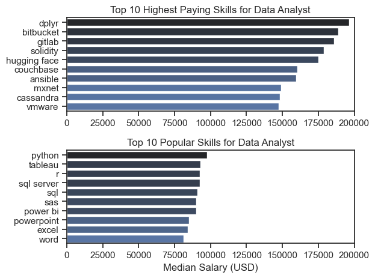
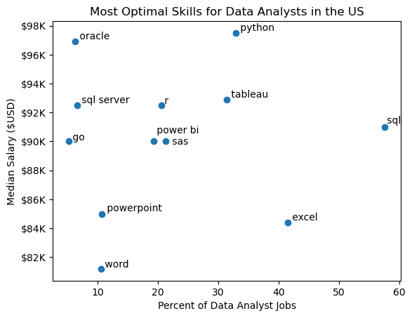

# Overview
This project presents an analysis of the data job market with a focus on data analyst roles. It was developed to better understand hiring trends and uncover the most valuable skills for aspiring analysts. The goal is to highlight both high-demand and high-paying skills that can help guide career decisions in data analytics.

The data is sourced from Luke Barousse’s Python Course, which offers a solid base for the analysis. It includes comprehensive information on job titles, salaries, locations, and relevant skills. Using Python, I explore key questions related to skill demand, salary patterns, and where those two intersect in the world of data.


# The Questions
Here are the main questions I aim to answer through this project:

1. What are the most in-demand skills for the top 3 data job roles?

2. How are these high-demand skills trending over time for Data Analysts?

3. What are the average salaries for these roles and associated skills?

4. Which skills offer the best mix of high demand and high pay for Data Analysts?


# Tools I Used
To carry out my in-depth analysis of the data analyst job market, I made use of several key tools and technologies:

* Python: The core language behind my analysis, used to manipulate data and extract meaningful insights. I utilized several powerful libraries:

    * Pandas: For data cleaning and manipulation.

    * Matplotlib: For building visual charts and graphs.

    * Seaborn: For creating visually appealing and insightful statistical plots.

* Jupyter Notebooks: Used to write and run my Python code in an interactive environment, making it easier to document my process and results.

* Visual Studio Code: My preferred code editor for writing and testing Python scripts efficiently.

* Git & GitHub: Crucial for version control, collaboration, and sharing my work with others.


# Analysis
## 1. What are the most demanded skills for the top 3 data roles?

To identify the most in-demand skills for the top three data roles, I first filtered the dataset to focus on the most popular job titles. Then, I extracted the top five skills associated with each of these roles. This analysis highlights the most common job titles and their key skills, helping me understand which skills to prioritize based on the role I'm targeting.

View my full notebook here: [2_Skill_Demand.ipynb](2_Skill_Demand.ipynb)

## Visualize data

```python
fig,ax = plt.subplots(3,1)
sns.set_theme(style='ticks')

for i, job in enumerate(jobs):
    df_plot = df_perc[df_perc['job_title_short'] == job].head(5)
    sns.barplot(data=df_plot, x='Percentage', y='job_skills',ax=ax[i], hue='job_skills', palette='dark:b_r')
    ax[i].set_title(job)
    ax[i].set_ylabel('') 
    ax[i].set_xlim(0,80)

    for n,val in enumerate(df_plot['Percentage']):
        ax[i].text(val+1,n,f'{val:.0f}%', va='center')

fig.suptitle('Count of Top Skills in Job Postings')
fig.set_size_inches((7,7))
fig.tight_layout()
```

## Results



## Insights

1. **SQL is a must-have** – used by over half of Analysts (51%), Engineers (68%), and Scientists (51%).
2. **Python is the most versatile skill** – critical for Scientists (72%) and Engineers (65%), with moderate demand for Analysts (27%).
3. **Role-specific tools matter** – Analysts rely on Excel (41%), while Engineers need cloud skills like AWS (43%), Azure (32%), and Spark (32%).
4. **Specialized tools add value** – Scientists often use R (44%) and Tableau (24%), while Analysts also benefit from Tableau (28%) and SAS (19%).


## 2. How are in-demand skills trending for Data Analysts?

I analyzed job postings to identify the most in-demand skills for Data Analyst roles in United States. I filtered and extracted the top skills by month, and visualized trends to understand how skill demand changes over time. This helps highlight which skills are most valuable for aspiring data professionals to focus on.


View my full notebook here: [3_Skills_Trend.ipynb](3_Skills_Trend.ipynb)

## Visualize data

```python
from adjustText import adjust_text

df_plot = df_US_pivot_sorted.iloc[:,:5]
sns.lineplot(df_plot,dashes=False,palette='tab10')
sns.set_theme(style='ticks')
sns.despine()

plt.title('Top skills for Data Analyst in United States')
plt.xlabel('')
plt.ylabel('Likelihood in Job Posting')
plt.legend().remove()

from matplotlib.ticker import PercentFormatter
ax = plt.gca()
ax.yaxis.set_major_formatter(PercentFormatter(decimals=0))

texts = []
for i in range(5):
    texts.append(plt.text(11.2,df_plot.iloc[-1,i], df_plot.columns[i]))

adjust_text(texts)

plt.show()

```

## Results


## Insights

1. SQL stays the top skill for Data Analysts all year, consistently above 45%.
2. Excel remains strong around 40%, with a dip in late year before bouncing back in December.
3. Tableau and Python trend closely, fluctuating between 25–30% across months.
4. SAS shows the lowest demand (17–22%), but remains steady throughout the year.


## 3. How well do jobs and skills pay for Data Analyst?

This section visualizes the yearly salary distribution (in USD) for various data roles in United States, including Data Analyst, Data Scientist, Data Engineer, and Senior positions. The chart highlights the median, interquartile range, and outliers for each role, giving a comparative view of compensation.

View my full notebook here: [4_Salary_Analysis.ipynb](4_Salary_Analysis.ipynb)

## Visualize data

```python
sns.boxplot(df_US_5,x='salary_year_avg',y='job_title_short', order=df_US_5_order)
sns.set_theme(style='ticks')

ax = plt.gca().xaxis
ax2 = plt.gca().yaxis
ax2.set_label_text('')
ax.set_label_text('Yearly Salary (USD)')
ax.set_major_formatter(plt.FuncFormatter(lambda x,pos: f'${int(x/1000)}K'))
plt.xlim(0,300000)
plt.title('Salary Distribution in United States')
plt.show()
```

## Results



## Insights

1. Senior Data Scientists earn the most, with the highest median and potential salaries among all roles.

2. Data Scientists have broad salary ranges, reflecting different experience levels and company pay scales.

3. Data Engineers show strong and consistent pay, slightly lower than Scientists but still competitive.

4. Data Analysts earn the least overall, though some outliers exceed $200K, and Senior Analysts earn more but still below Engineers and Scientists.

### Highest Paid and Most Demanded Skills for Data Analyst

This dual-bar chart compares the top 10 highest paying and top 10 most popular skills among Data Analysts. While some skills appear in both lists, others highlight the tradeoff between popularity and pay potential.


View my full notebook here: [4_Salary_Analysis.ipynb](4_Salary_Analysis.ipynb)

## Visualize data

```python
fig, ax = plt.subplots(2,1)

sns.set_theme(style='ticks')

sns.barplot(data=df_US_top_payed, x='median', y=df_US_top_payed.index, ax=ax[0], hue='median', palette='dark:b')
ax[0].set_title('Top 10 Highest Paying Skills for Data Analyst')
ax[0].set_ylabel('')
ax[0].set_xlabel('')
ax[0].legend().remove()
ax[0].set_xlim(0,200000)


sns.barplot(df_US_popular, x='median', y=df_US_popular.index, ax=ax[1], hue='median', palette='dark:b_r')
ax[1].set_title('Top 10 Popular Skills for Data Analyst')
ax[1].set_xlim(ax[0].get_xlim())
ax[1].legend().remove()
ax[1].set_ylabel('')
ax[1].set_xlabel('Median Salary (USD)')

fig.tight_layout()
plt.show()
```

## Results



## Insights

### Highest Paying Skills:

1. Specialized tools like dplyr, Bitbucket, GitLab, and Solidity command the highest pay, with median salaries close to $190K–$200K.

2. Cutting-edge technologies such as Hugging Face and MXNet also pay strongly, reflecting demand in AI/ML.

3. Backend and cloud-related tools (Couchbase, Cassandra, VMware) provide lucrative opportunities for Analysts moving into technical niches.

### Most Popular Skills:

1. Python, Tableau, and R lead in popularity, showing they are core Analyst skills.

2. SQL (server + SQL) remains widely required, underlining its foundational role.

3. Business tools like Excel, Power BI, and PowerPoint are highly common but offer lower salary growth compared to specialized tech skills.


## 4. What is the Most Optimal Skill to Learn for Data Analysts? 

In this analysis, I explored job market data to understand the most in-demand and highest-paying skills for Data Analyst roles. I examined skill trends across months, salary distributions by role, and identified which tools offer the best balance between demand and compensation. The goal was to uncover actionable insights to guide upskilling and career planning in the data field.


View my full notebook here: [5_Optimal_Skills.ipynb](5_Optimal_Skills.ipynb)

## Visualize data

```python

skill_limit = 5
df_DA_skills_high_demand = df_DA_skills[df_DA_skills['skill_percent'] > skill_limit]

from adjustText import adjust_text
plt.scatter(df_DA_skills_high_demand['skill_percent'], df_DA_skills_high_demand['median_salary'])
plt.xlabel('Percent of Data Analyst Jobs')
plt.ylabel('Median Salary ($USD)') 
plt.title('Most Optimal Skills for Data Analysts in the US')

ax = plt.gca()
ax.yaxis.set_major_formatter(plt.FuncFormatter(lambda y, pos: f'${int(y/1000)}K'))  

texts = []
for i, txt in enumerate(df_DA_skills_high_demand.index):
    texts.append(plt.text(df_DA_skills_high_demand['skill_percent'].iloc[i], df_DA_skills_high_demand['median_salary'].iloc[i], " " + txt))

adjust_text(texts)
plt.show()

```

## Results



## Insights
1. Python and Oracle offer the highest salaries (~$97K–98K), making them strong value skills despite moderate demand.

2. SQL, Excel, and Tableau are the most in-demand (30–55%), balancing high job opportunities with solid salaries (~$84K–93K).

3. BI tools (Power BI, Tableau) provide strong salary potential (~$90K+) at moderate demand, making them highly optimal.

4. Lower-value skills like Word and PowerPoint show both low demand and lower salaries (~$82K–85K), offering limited ROI.


# Key Takeaways
Throughout this project, I expanded my knowledge of the data analyst job landscape and sharpened my Python skills, particularly in data handling and visualization. Here are some specific lessons I gained:

* Proficient Python Application: Leveraging libraries like Pandas for data manipulation and Seaborn and Matplotlib for visualizations enabled me to carry out complex analyses more effectively.

* Essential Role of Data Cleaning: I discovered that meticulous data preparation is vital to ensure the reliability and accuracy of any insights generated.

* Analyzing Skill Trends Strategically: This project highlighted the value of aligning personal skills with market trends. Recognizing how skill demand, salary expectations, and job availability connect supports smarter career decisions in tech.


# Insights Gained
This project uncovered several broad observations about the data analytics job market:

* Link Between Skills and Pay: There’s a noticeable link between the demand for specific technical skills and the salaries they attract.

* Evolving Industry Patterns: The demand for skills changes over time, reflecting the fast-paced nature of the field. Staying updated on these shifts is crucial for career advancement in data analytics.

* Skills with High Return on Investment: Recognizing which competencies are both highly sought after and well-rewarded can help analysts make smart decisions about what to learn next to boost their earning potential.


# Challenges I Faced
Though the project came with its share of difficulties, it offered valuable learning experiences:

* Dealing with Messy Data: Managing incomplete or inconsistent datasets required deliberate strategies to maintain accuracy in analysis.

* Challenging Visualizations: Creating clear and meaningful visual presentations of complex information proved to be a demanding task.

* Breadth vs. Depth Tradeoff: One major challenge was determining how deep to explore each topic while still covering the full scope of the data without getting overwhelmed by the details.

# Conclusion

Exploring the data analyst job market proved to be highly insightful, shedding light on the essential skills and shifting trends within this dynamic field. The knowledge gained not only deepened my understanding but also offered practical guidance for those aiming to grow in the data analytics profession. With the industry constantly evolving, continuous analysis will be key to staying competitive. This project lays a solid groundwork for future investigations and emphasizes the need for ongoing learning and adaptability in the world of data analytics.
